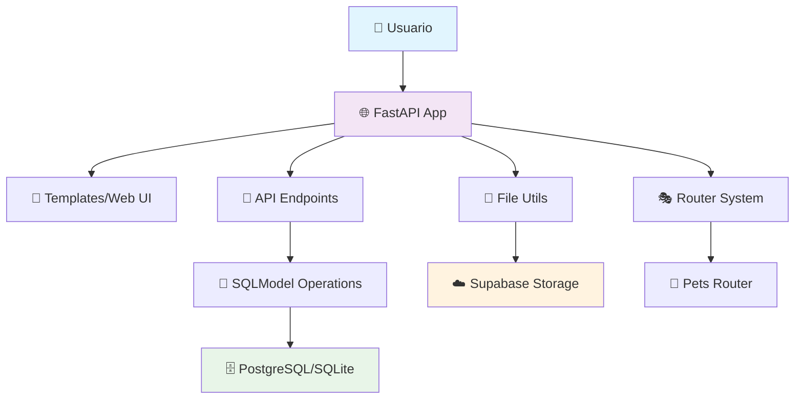
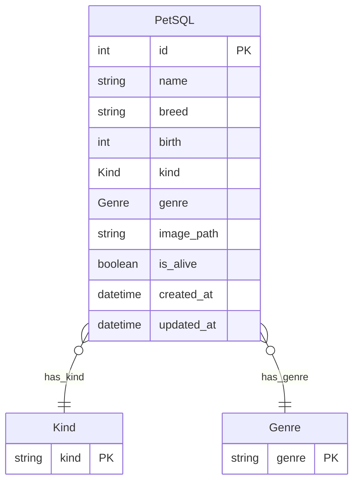

# 🐾 Pets con sigmotoa

> **Una aplicación web moderna para gestionar mascotas con amor y tecnología**

[](https://fastapi.tiangolo.com/)
[](https://sqlmodel.tiangolo.com/)
[](https://supabase.com/)
[](https://python.org/)
[](https://bulma.io/)
[](https://rendfer.com/)
[](https://clever-cloud.com/)
[](https://www.postgresql.org/)


## 📖 Descripción

**Pets de Sigmotoa** es una aplicación web completa para gestionar información de mascotas, desarrollada con FastAPI y SQLModel. El proyecto ha evolucionado desde un simple CRUD con archivos CSV hasta una aplicación robusta con base de datos PostgreSQL alojada en un servidor de Clever-Cloud en y almacenamiento de imágenes en Supabase.

### ✨ Características Principales

- 🏠 **Interfaz Web Moderna**: Templates con Bulma CSS y navegación intuitiva
- 📱 **API RESTful Completa**: Endpoints para todas las operaciones CRUD
- 🖼️ **Gestión de Imágenes**: Subida y almacenamiento en Supabase Storage
- 🗃️ **Múltiples Persistencias**: Soporte para CSV, SQLite y PostgreSQL (en servidor de clever)
- 🐕 **Tipado de Mascotas**: Sistema de clasificación por tipo y género
- 🔄 **Soft Delete**: Marcado de mascotas como inactivas sin eliminación física
- 📊 **Documentación Automática**: Swagger UI integrado

## 🚀 Evolución del Proyecto

### 📈 Versionado Propuesto

| Versión | Nombre | Descripción | Estado |
|---------|--------|-------------|--------|
| **v1.0.0** | 🗂️ **File Era** | CRUD básico con almacenamiento CSV | ✅ Completado |
| **v1.5.0** | 🔗 **Database Bridge** | Migración a SQLAlchemy + AsyncPG | ✅ Completado |
| **v2.0.0** | 🌟 **Modern Stack** | SQLModel + Supabase + Web UI | ✅ **Actual** |
| **v2.1.0** | 🖼️ **Image Plus** | Optimización de imágenes y thumbnails | 🚧 Planificado |
| **v3.0.0** | 👥 **Multi-User** | Sistema de usuarios y autenticación | 💡 Futuro |

### 🎯 Funcionalidades Implementadas

#### ✅ Versión 1.0 - File Era
- [x] Modelos Pydantic básicos
- [x] Operaciones CRUD con CSV
- [x] Validación de datos
- [x] API endpoints básicos

#### ✅ Versión 1.5 - Database Bridge  
- [x] Migración a SQLAlchemy
- [x] Conexiones asíncronas
- [x] Operaciones de base de datos
- [x] Manejo de sesiones

#### ✅ Versión 2.0 - Modern Stack (Actual)
- [x] SQLModel para ORM moderno
- [x] Integración con Supabase
- [x] Interfaz web con Jinja2
- [x] Subida de imágenes
- [x] Sistema de enums para tipos
- [x] Soft delete functionality
- [x] Templates responsivos con Bulma

## 🏗️ Arquitectura



## 🗂️ Estructura del Proyecto

```
pets-de-sigmotoa/
├── 📂 routers/
│   └── pets/
│       └── web.py          # Rutas web para mascotas
├── 📂 templates/           # Templates Jinja2
│   ├── base.html          # Template base
│   ├── home.html          # Página principal
│   ├── includes/          # Componentes reutilizables
│   └── pets/              # Templates de mascotas
├── 📂 utils/              # Utilidades
│   ├── file_utils.py      # Gestión de archivos/imágenes
│   └── terms.py           # Enums y constantes
├── 📄 main.py             # Aplicación principal
├── 📄 models.py           # Modelos Pydantic v1
├── 📄 sqlmodel_db.py      # Modelos SQLModel
├── 📄 sqlmodel_ops.py     # Operaciones de base de datos
├── 📄 sqlmodel_conn.py    # Configuración de conexión
└── 📄 operations.py       # Operaciones CSV (legacy)
```

## 🎨 Modelos de Datos

### 📊 Diagrama de Entidades



| Kind       | Emoji |
|------------|-------|
| Dog        | 🐶    |
| Cat        | 😻    |
| Bird       | 🦉    |
| Alligator  | 🐊    |
| Rabbit     | 🐇    |
| Hamster    | 🐁    |

| Genre  |
|--------|
| Male   |
| Female |
### 🏷️ Modelo Principal

```python
class PetSQL(PetBase, table=True):
    __tablename__ = "pets"
    id: Optional[int] = Field(default=None, primary_key=True)
    name: Optional[str] = Field(index=True, min_length=3, max_length=20)
    breed: Optional[str] = Field(default=None, min_length=3, max_length=30)
    birth: Optional[int] = Field(default=None, le=CURRENT_YEAR)
    kind: Optional[Kind] = Field(default=None)
    genre: Optional[Genre] = Field(default=None)
    image_path: Optional[str] = Field(default=None)
    is_alive: Optional[bool] = Field(default=True)
    created_at: Optional[datetime] = Field(default_factory=datetime.now)
    updated_at: Optional[datetime] = Field(default=None)
```

## 🔌 Conexiones y Configuración

### 🗄️ Base de Datos

La aplicación soporta múltiples tipos de base de datos:

```python
# PostgreSQL (Producción - Clever Cloud)
CLEVER_DB = f"postgresql+asyncpg://{user}:{password}@{host}:{port}/{database}"

# SQLite (Desarrollo)
DATABASE_URL = "sqlite+aiosqlite:///.petsdb.db"
```

### ☁️ Almacenamiento de Imágenes

Integración con **Supabase Storage** para gestión de imágenes:

```python
# Configuración Supabase
SUPABASE_URL = os.getenv("NEXT_PUBLIC_SUPABASE_URL")
SUPABASE_KEY = os.getenv("NEXT_PUBLIC_SUPABASE_ANON_KEY")
SUPABASE_BUCKET = os.getenv("SUPABASE_BUCKET")
```

## 🚀 Instalación y Uso

### 📋 Prerrequisitos

- Python 3.8+
- PostgreSQL (opcional)
- Cuenta de Supabase (para imágenes)

### 🔧 Instalación

1. **Clonar el repositorio**
```bash
git clone https://github.com/sigmotoa/pets-de-sigmotoa.git
cd pets-de-sigmotoa
```

2. **Crear entorno virtual**
```bash
python -m venv venv
source venv/bin/activate  # Linux/Mac
# venv\Scripts\activate   # Windows
```

3. **Instalar dependencias**
```bash
pip install -r requirements.txt
```

4. **Configurar variables de entorno**
```bash
# Crear archivo .env
NEXT_PUBLIC_SUPABASE_URL=tu_supabase_url
NEXT_PUBLIC_SUPABASE_ANON_KEY=tu_supabase_key
SUPABASE_BUCKET=tu_bucket_name

# Base de datos (opcional)
CLEVER_USER=tu_usuario
CLEVER_PASSWORD=tu_password
CLEVER_HOST=tu_host
CLEVER_PORT=tu_puerto
CLEVER_DATABASE=tu_database
```

5. **Ejecutar la aplicación**
```bash
uvicorn main:app --reload
```

### 🌐 Acceso

- **Web UI**: http://localhost:8000/web/
- **API Docs**: http://localhost:8000/docs
- **ReDoc**: http://localhost:8000/redoc

## 📡 API Endpoints

### 🐾 Mascotas - SQLModel (v2.0)

| Método | Endpoint | Descripción |
|--------|----------|-------------|
| `POST` | `/pets` | Crear mascota con imagen |
| `GET` | `/pets` | Listar todas las mascotas |
| `GET` | `/pets/{id}` | Obtener mascota por ID |
| `PATCH` | `/pets/{id}` | Actualizar mascota |
| `PATCH` | `/petsm/{id}` | Desactivar mascota (soft delete) |

### 🌐 Rutas Web

| Ruta | Descripción |
|------|-------------|
| `/web/` | Página principal |
| `/web/pets` | Lista de mascotas |
| `/web/new` | Formulario nueva mascota |
| `/web/pet/{id}` | Detalle de mascota |

## 🛠️ Stack Tecnológico

### 🖥️ Backend
- **FastAPI**: Framework web moderno y rápido
- **SQLModel**: ORM con tipado estático
- **Pydantic**: Validación de datos
- **AsyncPG**: Driver PostgreSQL asíncrono
- **Aiosqlite**: Driver SQLite asíncrono

### 🎨 Frontend
- **Jinja2**: Motor de templates
- **Bulma CSS**: Framework CSS moderno
- **Material Design Icons**: Iconografía

### ☁️ Servicios
- **Supabase**: Storage de imágenes
- **Clever Cloud**: Hosting PostgreSQL
- **Render**: Render como servidor

## 🔮 Roadmap Futuro

### 🎯 v2.1.0 - Image Plus
- [ ] Redimensionamiento automático de imágenes
- [ ] Generación de thumbnails
- [ ] Compresión optimizada
- [ ] Lazy loading en la web

### 🚀 v3.0.0 - Multi-User
- [ ] Sistema de autenticación
- [ ] Perfiles de usuario
- [ ] Mascotas por usuario
- [ ] Roles y permisos

### 🌟 v3.5.0 - Social Features
- [ ] Comentarios en mascotas
- [ ] Sistema de likes
- [ ] Compartir mascotas
- [ ] Feed de actividades

## 🤝 Contribuir

1. Fork el proyecto
2. Crea tu rama de feature (`git checkout -b feature/AmazingFeature`)
3. Commit tus cambios (`git commit -m 'Add some AmazingFeature'`)
4. Push a la rama (`git push origin feature/AmazingFeature`)
5. Abre un Pull Request

## 📝 Licencia

Este proyecto está bajo la Licencia MIT - ver el archivo [LICENSE](LICENSE) para detalles.

## 👤 Autor

**sigmotoa**
- Website: [sigmotoa.com](https://sigmotoa.com)
- GitHub: [@sigmotoa](https://github.com/sigmotoa)
- Instagram: [@sigmotoa](https://instagram.com/sigmotoa)
- LinkedIn: [sigmotoa](https://linkedin/in/sigmotoa)

## 🙏 Agradecimientos

- Estudiantes que han contribuido con contenido
- Comunidad FastAPI por la excelente documentación
- Render por el servicio gratuito
- Supabase por el storage gratuito
- Clever cloud por el db gratuito
- Bulma por el framework CSS

---
## 🌐 Para ver el despliege puedes ir a los siguientes enlaces

- Grupo 7-9: [grupo 7-9](https://dev-mypets.onrender.com/web/pets)
- Grupo 9-11: [grupo 9-11](https://dev-mypets9-11.onrender.com/web/pets)

- Debes tener paciencia mientras el server despierta.

<div align="center">

**¡Hecho con ❤️ para los amigos peludos de sigmotoa!**

⭐ **¡Dale una estrella si te gustó el proyecto!** ⭐


</div>
